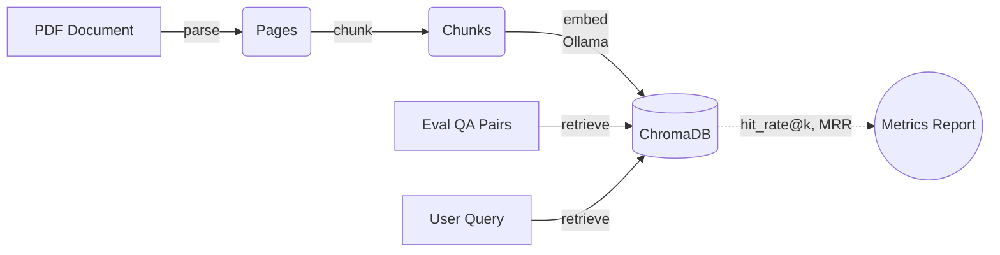

<div align="center">
  <h1> RAG EvalForge</h1>
  <p><i>Build a Retrieval-Augmented Generation (RAG) pipeline over a technical-writing textbook and <b>benchmark chunking strategies</b> on retrieval quality — all running locally with Ollama embeddings and ChromaDB.</i></p>
  
  <p>
    
    
    
    
  </p>
</div>

<hr>

##  Overview

The core question this project answers: **How does document chunking affect retrieval performance?** 

By indexing four distinct chunking strategies into separate ChromaDB collections, this project scores them against a hand-labeled QA dataset using `hit_rate@k` and Mean Reciprocal Rank (MRR).

###  Key Features
- **Local RAG Pipeline:** Fully offline architecture using local LLMs and embeddings (Ollama) and vector storage (ChromaDB).
- **Strategy Benchmarking:** Compare Fixed, Recursive, Sentence, and Semantic chunking side-by-side.
- **Interactive UI:** Built-in Streamlit dashboard for data ingestion, querying, and evaluation history.
- **Idempotent Ingestion:** Robust document ingestion with content-hash based deduplication.

---

##  Architecture & Pipeline



- **Ingest**: `parse_pdf` extracts page text with PyMuPDF; each strategy chunks the pages into `{chunk_id, text, page_number, strategy}` records.
- **Embed**: `nomic-embed-text` via Ollama (768-dim) produces the dense vectors.
- **Store**: One Chroma collection per strategy (`rag_fixed`, `rag_recursive`, `rag_sentence`, `rag_semantic`), keyed by a content-hash `doc_id` so re-ingesting the same file is idempotent.
- **Evaluate**: 20 hand-labeled question/page pairs (`src/evaluation/test_qa_pairs.json`) are queried against each collection and scored on page-level `hit_rate@k` and `MRR`.

---

##  Chunking Strategies

| Strategy | How it splits text | Chunk keying |
|:---|:---|:---|
| **`fixed`** | Hard character window (500 chars, 50 overlap) | `docid_fixed_page_start_end` |
| **`recursive`** | Recursive split on `\n\n` → `\n` → `. ` → ` ` | `docid_recursive_page_i` |
| **`sentence`** | Sentence-boundary split, overlap carries sentence tail | `docid_sentence_page_i` |
| **`semantic`** | Sentence embeddings; new chunk when consecutive-sentence cosine similarity drops below a threshold (0.7), or the size cap is hit | `docid_semantic_page_i` |

---

##  Project Structure

```text
rag-evalforge/
├── app/
│   └── streamlit_app.py      # Streamlit UI: ingest, ask, evaluate, history
├── src/
│   ├── config.py             # Configuration and environment variables
│   ├── embeddings/           # Embedding & Vector DB logic
│   ├── ingestion/            # Document parsing and chunking implementations
│   └── evaluation/           # Benchmarking scripts and metrics
├── data/                     # Raw PDFs, Chroma DB storage, Eval results
└── tests/                    # Unit tests for chunkers
```

---

##  Getting Started

### Prerequisites

- Python 3.11+
- [Ollama](https://ollama.com/) running locally with the following models pulled:

```sh
ollama pull nomic-embed-text
ollama pull qwen2.5:7b
```

### Installation

1. **Clone and setup the environment:**
   ```sh
   python -m venv venv
   source venv/bin/activate
   pip install -r requirements.txt
   ```

2. **Configure environment variables:**
   ```sh
   cp .env.example .env
   ```
   
   Ensure your `.env` file contains:
   ```ini
   LLM_MODEL=qwen2.5:7b
   EMBED_MODEL=nomic-embed-text
   CHROMA_DB_PATH=./data/chroma_db
   OLLAMA_HOST=http://localhost:11434
   ```

3. **Verify the installation:**
   ```sh
   python smoke_test.py
   ```

---

##  Usage Guide

### 1. Ingest a PDF
Process and index a document using all four chunking strategies:
```sh
python src/ingestion/ingest.py                      # Uses the bundled sample PDF
python src/ingestion/ingest.py path/to/other.pdf    # Or provide a specific file
```

### 2. Run the Retrieval Benchmark
Evaluate all strategies against the labeled QA dataset:
```sh
python src/evaluation/run_eval.py --k 5
```
> *Prints a strategy-vs-metrics table and saves results to `data/eval_results/`.*

### 3. Tune Semantic Threshold
Fine-tune the semantic chunker's similarity threshold:
```sh
python src/evaluation/sweep_threshold.py
```
> *Reports chunk count, length, hit rate, and MRR per threshold. Restores the collection at the threshold closest to the target chunk count.*

### 4. Launch Streamlit UI
Access the interactive web dashboard:
```sh
streamlit run app/streamlit_app.py
```

| Dashboard Page | Description |
|:---|:---|
|  **Ingest** | Upload PDFs, chunk + embed with all strategies, and monitor progress. |
|  **Ask** | Retrieve top-k chunks and generate LLM answers grounded in context. |
|  **Evaluate** | Run benchmarks interactively and save results. |
|  **History** | Compare saved evaluation runs side-by-side. |

---

## Evaluation Metrics & Results

Scoring is performed at the page-level against the ground-truth `page_number` in each QA pair:

- **`hit_rate@k`**: `1` if any retrieved chunk is from the expected page, else `0`. Averaged across the dataset.
- **`MRR` (Mean Reciprocal Rank)**: `1/rank` of the first chunk from the expected page, or `0` if it is not in the top-k. Heavily penalizes correct-but-low-ranked retrievals.

### Latest Benchmark Results (k=5)

*Run: `eval_results_20260802_204421.json`*

| Strategy | Chunks | Hit Rate @ 5 | MRR |
|:---|---:|---:|---:|
| `fixed` | 125 | 0.950 | 0.778 |
| **`recursive`** | 126 | **1.000** | **0.858** |
| `sentence` | 167 | 0.950 | 0.850 |
| `semantic` (t=0.3) | 168 | 0.950 | 0.850 |

> ** Note on Granularity Confound:** 
> The default semantic threshold (0.7) over-segments this specific document into 317 chunks. This biases raw comparisons against strategies yielding ~125–167 chunks. The threshold was swept and set to 0.3 (168 chunks) to match `sentence`/`recursive` granularity before scoring. Under this matched comparison, semantic performs on par with sentence boundaries.

> ** Interpretation Caveats:** 
> - The test set is small (20 QA pairs). A single miss shifts the hit rate by 0.05. 
> - MRR is capped at 1.0. Near-ceiling strategies are difficult to separate statistically. Treat the top scores as an effective tie.
> - Only retrieval quality is measured here. Generation quality scoring is planned for future updates (`src/retrieval/`, `src/generation/`, and `src/vectorstore/`).

---

</div>