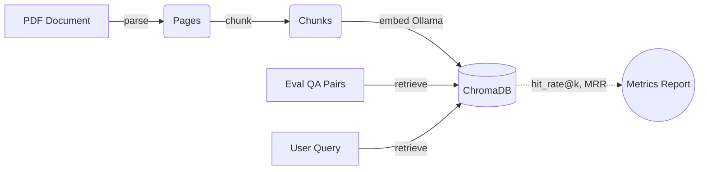

<div align="center">

  <h1>RAG EvalForge</h1>
  <p><i>A production-grade Retrieval-Augmented Generation (RAG) research harness that benchmarks chunking strategies and retrieval pipelines on retrieval quality — fully local with Ollama + ChromaDB.</i></p>

  <p>
    
    
    
    
    
    
    
  </p>

</div>

---

## Overview

RAG EvalForge answers one question: **how does document chunking affect retrieval and generation quality?**

It indexes documents under four chunking strategies into separate ChromaDB collections and scores them against a hand-labeled QA dataset using `hit_rate@k` and Mean Reciprocal Rank (MRR) — then optionally measures full RAG answer quality with an LLM-as-a-judge. Everything runs locally (Ollama embeddings + LLMs, ChromaDB vector store, SQLite experiment registry), with a Streamlit UI and a Docker Compose stack for a one-command setup.

---

## Key Features

- **Chunking benchmark** — Fixed, Recursive, Sentence, and Semantic strategies compared side-by-side.
- **Multi-embedding evaluation** — The same strategies under multiple embedding models, with per-model collection namespacing (`rag_<strategy>__<model>`).
- **Advanced retrieval** — Dense (Chroma), lexical (numpy-vectorized BM25Okapi), hybrid fusion via Reciprocal Rank Fusion, and embedding / cross-encoder re-ranking.
- **Generation quality metrics** — LLM-as-a-judge scoring of faithfulness, answer correctness, and answer relevancy.
- **Experiment tracking** — Every run persisted to SQLite with git commit, config, dataset hash, hyper-parameters, and per-query metrics.
- **Interactive UI + Docker** — Streamlit dashboard for ingest/query/evaluate/history; one-command deployment via `docker compose`.

---

## Tech Stack

| Layer | Technology |
|:---|:---|
| Language | Python 3.11+ |
| Vector store | ChromaDB |
| Embeddings / LLMs | Ollama (`nomic-embed-text`, `qwen2.5:7b`) |
| Retrieval | BM25Okapi, Reciprocal Rank Fusion, cross-encoder re-ranking |
| PDF parsing | PyMuPDF |
| UI | Streamlit |
| Experiment store | SQLite |
| Deployment | Docker / Docker Compose |

---

## Code Quality & Engineering Standards

RAG EvalForge is built to industry-grade standards and passes a **full automated QA gate on every push** (GitHub Actions on Python 3.11/3.12/3.13). Every static-analysis finding discovered during development has been resolved.

### QA Toolchain — All Green

| Tool | Purpose | Result |
|:---|:---|:---|
| **pytest** | Automated unit & integration tests | **108 / 108 passing** (fully offline, no network) |
| **coverage** | Test coverage measurement | **89% line coverage**; 100% on core retrieval, generation-judge, and RAG-eval modules |
| **pylint** | Static analysis / code style | **10.00 / 10** rating |
| **ruff** | Linting + formatting (F, E, I, UP, B, SIM, C4, RUF rules) | **0 errors**, fully format-clean |
| **pyright** | Static type checking | **0 errors, 0 warnings** |
| **bandit** | Security scanning | **0 issues** (no vulnerable patterns) |
| **radon** | Complexity & maintainability metrics | Average cyclomatic complexity **A (2.83)**; maintainability rating **A** |
| **scalene** | CPU/memory profiling | Representative pipeline profiled; no hotspots detected |

### Engineering Rigor

- **Type safety** — The entire codebase is statically type-checked with pyright; ChromaDB integration uses typed `QueryResult` models with explicit `None`-guards instead of unchecked dict access.
- **Security** — `bandit` reports zero issues; all `subprocess` usage is audited (fixed arguments, `shell=False`, timeouts) and covered with targeted annotations.
- **Correctness** — Optional-heavy retrieval code uses explicit exception handling (`raise`/`contextlib.suppress`) rather than `assert` statements, which are stripped under `-O`.
- **Clean code** — `ruff` formatting is enforced in CI (`ruff format --check .`), keeping the codebase uniformly formatted across 38 files.
- **Reproducibility** — Offline test suite with deterministic fakes; every benchmark run is captured in the SQLite registry with its git commit and dataset hash.

### Run the QA Gate Locally

```sh
make lint      # pylint + ruff check + ruff format --check
make qa        # full gate: lint + pyright + bandit + tests with coverage
make profile   # scalene CPU profile on scripts/bench.py
```

---

## Architecture



- **Ingest** — `parse_pdf` extracts page text (PyMuPDF); each strategy produces `{chunk_id, text, page_number, strategy}` records, keyed by a content-hash `doc_id` for idempotent re-ingestion.
- **Embed** — `nomic-embed-text` via Ollama (768-dim dense vectors).
- **Store** — one Chroma collection per strategy (`rag_fixed`, `rag_recursive`, `rag_sentence`, `rag_semantic`), namespaced per embedding model.
- **Evaluate** — 20 hand-labeled question/page pairs scored on page-level `hit_rate@k` and MRR.

---

## Chunking Strategies

| Strategy | How it splits text |
|:---|:---|
| **`fixed`** | Hard character window (500 chars, 50 overlap) |
| **`recursive`** | Recursive split on `\n\n` → `\n` → `. ` → space |
| **`sentence`** | Sentence-boundary split, overlap carries the sentence tail |
| **`semantic`** | Sentence embeddings; new chunk when consecutive-sentence cosine similarity drops below a threshold (0.7) or the size cap is hit |

---

## Project Structure

```text
rag-evalforge/
├── app/                   # Streamlit UI: ingest, ask, evaluate, history
├── scripts/               # Benchmark helpers (e.g. scalene profiling target)
├── src/
│   ├── config.py          # Configuration & environment variables
│   ├── embeddings/        # Ollama embedding functions & ChromaDB layer
│   ├── ingestion/         # PDF parsing and the four chunkers
│   ├── retrieval/         # Dense, BM25, hybrid (RRF), and re-ranking
│   ├── generation/        # Grounded answers + LLM-as-a-judge metrics
│   ├── evaluation/        # Benchmarking scripts and metrics
│   └── experiment/        # SQLite experiment registry
├── tests/                 # 108 offline unit tests with deterministic fakes
├── data/                  # Raw PDFs, ChromaDB storage, eval results
├── .github/workflows/     # CI: pylint, ruff, pyright, bandit, pytest+coverage
├── Dockerfile
├── docker-compose.yml
└── Makefile
```

---

## Getting Started

### Prerequisites

- Python 3.11+
- [Ollama](https://ollama.com/) running locally:

```sh
ollama pull nomic-embed-text
ollama pull qwen2.5:7b
```

### Local setup

```sh
python -m venv venv && source venv/bin/activate
pip install -r requirements.txt
cp .env.example .env
python smoke_test.py
```

Your `.env` needs:

```ini
LLM_MODEL=qwen2.5:7b
EMBED_MODEL=nomic-embed-text
CHROMA_DB_PATH=./data/chroma_db
OLLAMA_HOST=http://localhost:11434
```

### Docker (optional)

No local Python or Ollama required:

```sh
docker compose up -d --build
```

This starts Ollama (auto-pulls both models) and the app at `http://localhost:8501`, with persistent volumes for models and app data.

---

## Usage

### 1. Ingest a PDF

```sh
python src/ingestion/ingest.py                    # bundled sample PDF
python src/ingestion/ingest.py path/to/other.pdf  # or a specific file
```

### 2. Benchmark retrieval

```sh
python src/evaluation/run_eval.py --k 5                      # retrieval-only
python src/evaluation/run_eval.py --k 5 --hybrid             # + BM25/dense fusion & re-ranking
python src/evaluation/run_eval.py --k 5 --hybrid --rag       # + LLM-as-a-judge answer quality
```

Benchmark multiple embedding models side-by-side:

```sh
ollama pull all-minilm:33m
python src/ingestion/ingest.py --embed-model all-minilm:33m
python src/evaluation/run_eval.py --k 5 --embed-models nomic-embed-text,all-minilm:33m
```

### 3. Tune the semantic threshold

```sh
python src/evaluation/sweep_threshold.py
```

### 4. Launch the Streamlit UI

```sh
streamlit run app/streamlit_app.py
```

| Page | Purpose |
|:---|:---|
| **Ingest** | Upload PDFs, chunk + embed with all strategies |
| **Ask** | Retrieve top-k chunks (dense or hybrid, optionally re-ranked) and generate grounded answers |
| **Evaluate** | Run retrieval or full-RAG benchmarks and save results |
| **History** | Compare saved evaluation runs side-by-side |

---

## Metrics & Results

Scoring is page-level against the ground-truth `page_number` in each QA pair:

- **`hit_rate@k`** — `1` if any retrieved chunk is from the expected page, else `0`.
- **`MRR`** — reciprocal rank of the first chunk from the expected page; penalizes correct-but-low-ranked retrievals.

### Latest benchmark (k=5)

| Strategy | Chunks | Hit Rate @ 5 | MRR |
|:---|---:|---:|---:|
| `fixed` | 125 | 0.950 | 0.778 |
| **`recursive`** | 126 | **1.000** | **0.858** |
| `sentence` | 167 | 0.950 | 0.850 |
| `semantic` (t=0.3) | 168 | 0.950 | 0.850 |

> The default semantic threshold over-segments this document; the threshold was swept to match the granularity of the other strategies before scoring. The test set is small (20 pairs) and MRR is near-ceiling, so top scores should be read as an effective tie.
